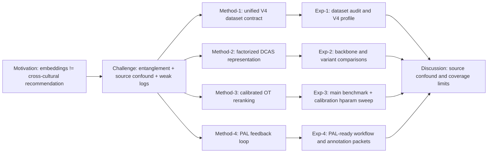

# Paper Storyline And Claim Map (2026-03-21)

## 1. 推荐故事线

最稳的故事线不是“我们发明了一个新 VAE”，而是：

1. `Motivation`
   - 强大的音频基础 embedding 并不会自动解决跨文化推荐
   - 在这个任务里，系统既要保持相关性，又要避免把少数文化内容淹没
2. `Challenge`
   - 原始 embedding 会把文化风格、功能相关性、来源偏差缠在一起
   - 数据存在 `source confound`
   - 单一准确率指标不足以描述跨文化推荐质量
3. `Solution`
   - 统一的 `backbone-agnostic` 管线：`dataset contract -> factorized DCAS -> calibrated reranking -> PAL loop`
   - 把“表示学习、校准重排、人类反馈”拆成模块，而不是做成黑盒端到端
4. `Validation`
   - `V4 main / V4 routeA_small`
   - `CultureMERT / Gemini`
   - 主实验、变体比较、消融、校准超参实验、PAL-ready workflow

## 2. 论文章节篇幅建议

- `Introduction`: 15%
- `Related Work`: 15%
- `Method`: 30%
- `Experiments`: 30%
- `Discussion + Limitations + Conclusion`: 10%

如果按 ISMIR 风格压缩，可进一步调成：

- `Introduction`: 13%
- `Related Work`: 12%
- `Method`: 28%
- `Experiments`: 35%
- `Discussion/Limitations/Conclusion`: 12%

## 3. 章节依赖图

## 4. 主文可保守主张

### Claim C1

统一数据协议和下游框架可以在不同 embedding backbone 上复用。

证据：

- `V4 main + CultureMERT`
- `V4 routeA_small + CultureMERT`
- `V4 main + Gemini`
- `V4 routeA_small + Gemini`

### Claim C2

校准重排层不是装饰项，而是能系统性改变 `serendipity / calibration / minority exposure` 的 Pareto trade-off。

证据：

- [V4_CALIBRATION_HPARAM_SWEEP_RESULTS_2026-03-21_CN.md](E:/Desktop/Echo/docs/research_dataset_v4/V4_CALIBRATION_HPARAM_SWEEP_RESULTS_2026-03-21_CN.md)

### Claim C3

模型最有价值的部分不只是 backbone，而是“factorized representation + calibrated reranking + PAL-ready loop”的模块化组合。

证据：

- [phase2_academic_archaeology_report.md](E:/Desktop/Echo/reports/audits/phase2_academic_archaeology_2026-03-21/phase2_academic_archaeology_report.md)
- [run_ablation.py](E:/Desktop/Echo/dcas/scripts/run_ablation.py)
- [ablation_summary.json](E:/Desktop/Echo/reports/ablation/v2_main_gemini/ablation_summary.json)

### Claim C4

系统在强调少数文化暴露时，不需要以灾难性代价牺牲整体推荐质量。

证据：

- `V4 main + CultureMERT` calibration sweep
- `V4 routeA_small + Gemini` calibration sweep

## 5. 不建议在主文中说得过满的话

- 不建议写“所有 backbone 上所有指标全面最优”
- 不建议写“已经解决 source bias”
- 不建议把 `routeA_small` 写成与 `V4 main` 等强度证据
- 不建议把 PAL 写成“已经完成真人闭环结果”，当前更准确是“PAL-ready and execution-ready”

## 6. 章节写作要点

### Introduction

- 第一段讲问题，不讲实现
- 第二段讲为什么常规 embedding retrieval 不够
- 第三段引出我们的方法是“结构化下游框架”而不是“更大的 backbone”
- 结尾给 3 个贡献点

### Method

- 用 `Data / Model / Training / Inference / PAL` 五段式
- 不把所有正则项平均展开，要先讲主目标，再讲附加 regularizers
- 把 stage-wise curriculum 单独写成一小节

### Experiments

- 先给 V4 dataset 与 audit，再给主结果
- 然后讲 cross-backbone
- 再讲消融和超参
- 最后讲 PAL workflow 与 limitations

### Discussion and Limitations

- 第一优先写 `source confound`
- 第二优先写 `routeA_small era coverage = 0`
- 第三优先写工程 warning 和 medium-scale scalability

## 7. 投稿口径建议

### 稳健版

最适合当前稿件：

> We present a modular and backbone-agnostic framework for culturally calibrated music recommendation. The contribution is not a new foundation model, but a reusable downstream stack that combines factorized representation learning, calibration-aware reranking, and PAL-ready human feedback under a unified V4 data contract.

### 激进版

只建议在封面摘要或 rebuttal 中局部使用：

> We argue that cross-cultural recommendation should not be treated as monolithic nearest-neighbor retrieval, but as a calibrated, feedback-aware representation problem.

### 应用版

适合工业或系统会议：

> The pipeline shows how existing audio embeddings can be upgraded into culturally calibrated recommenders without replacing the upstream embedding backbone.

