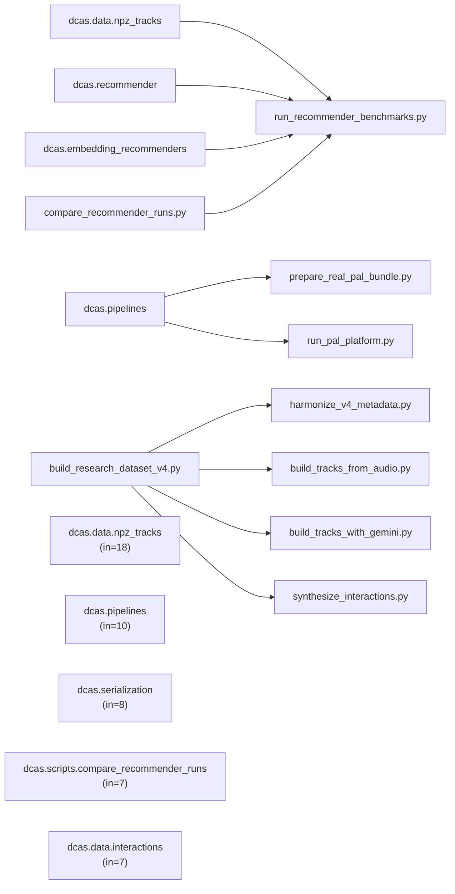
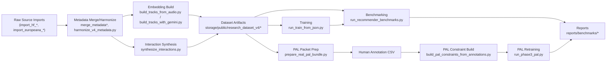

# Phase 1 Workspace Diagnostic

## Scope

- Goal: repository-wide diagnostic for file structure, executability, configs, figures, datasets, results, and reproducibility.
- Branch: `feature/research-v2-platform-and-results`
- Commit: `6a4a1d9a8f8cf1bceff84656ca1edb1588095cb8`

## Workspace Structure

| top-level path | kind | file_count |
|---|---|---:|
| .gitignore | file | 1 |
| build.ps1 | file | 1 |
| configs | dir | 75 |
| dcas | dir | 176 |
| dcas_server | dir | 10 |
| dev.ps1 | file | 1 |
| dht-main | dir | 34 |
| docs | dir | 129 |
| echo_web_publish | dir | 160 |
| NEXT_STEPS_ROADMAP.md | file | 1 |
| output | dir | 6 |
| paper | dir | 6 |
| README.md | file | 1 |
| reports | dir | 948 |
| requirements.txt | file | 1 |
| scripts | dir | 2 |
| storage | dir | 17619 |
| tmp | dir | 18080 |
| tmp_dunya_andalusian_snippet.html | file | 1 |
| tmp_dunya_developers.html | file | 1 |
| tmp_georgia_tismir.html | file | 1 |
| tmp_kazakh_README.md | file | 1 |
| toy | dir | 14 |
| toy_small | dir | 4 |
| voice_plan.pdf | file | 1 |
| voice_plan_extracted.txt | file | 1 |
| web | dir | 36442 |
| 声音.pdf | file | 1 |
| 声音.txt | file | 1 |

## Code Dependency Graph

## Data Flow Graph

## Core Files vs Auxiliary Files

| path | bucket | paper_section | tracked | rationale |
|---|---|---|---|---|
| dcas/models/dcas_vae.py | core_method | Method | true | Main disentanglement / recommendation backbone implementation. |
| dcas/recommender.py | core_method | Method | true | Core recommendation scoring and evaluation-facing inference entry. |
| dcas/embedding_recommenders.py | baseline_family | Method | true | Industrial-style embedding, KNN, cosine, BPR and hybrid recommenders. |
| dcas/pipelines.py | pipeline_orchestration | Method | true | Shared wiring between data, training, evaluation, and PAL stages. |
| dcas/scripts/build_research_dataset_v4.py | dataset_pipeline | Dataset | true | End-to-end V4 dataset build orchestration. |
| dcas/scripts/harmonize_v4_metadata.py | dataset_pipeline | Dataset | true | Metadata normalization and field alignment for V4. |
| dcas/scripts/build_tracks_from_audio.py | embedding_pipeline | Method | true | Audio-to-embedding builder for CultureMERT and related backbones. |
| dcas/scripts/build_tracks_with_gemini.py | embedding_pipeline | Method | true | Gemini embedding extraction pipeline with API/window controls. |
| dcas/scripts/synthesize_interactions.py | dataset_pipeline | Dataset | true | Synthetic interaction generation used by released benchmark datasets. |
| dcas/scripts/run_train_from_json.py | experiment_runner | Appendix | true | Reusable training entrypoint driven by JSON configs. |
| dcas/scripts/run_recommender_benchmarks.py | experiment_runner | Experiments | true | Main benchmark runner used for V3/V4 result matrices. |
| dcas/scripts/evaluate_recommender.py | experiment_runner | Experiments | true | Computes benchmark metrics and comparison outputs. |
| dcas/scripts/prepare_real_pal_bundle.py | pal_human_loop | Method | true | Builds the real PAL task packet and candidate pool. |
| dcas/scripts/run_phase3_pal.py | pal_human_loop | Method | true | Closes the PAL feedback loop from constraints to retraining. |
| dcas/scripts/build_pal_constraints_from_annotations.py | pal_human_loop | Method | true | Transforms human annotation sheets into PAL constraints. |
| configs/dataset/research_dataset_v4_main_from_v3.json | config_primary | Appendix | true | Primary V4 main dataset contract. |
| configs/dataset/research_dataset_v4_routeA_small.json | config_primary | Appendix | true | Primary V4 small dataset contract. |
| configs/train/train_v4_main_culturemert_stage3.run.json | config_primary | Appendix | true | Primary V4 main CultureMERT stage3 training setup. |
| configs/train/train_v4_main_gemini_stage3.run.json | config_primary | Appendix | true | Primary V4 main Gemini stage3 training setup. |
| configs/benchmark/recommender_benchmark_v4_main_culturemert_stage3_lambdamart.run.json | config_primary | Appendix | true | Primary V4 main CultureMERT benchmark setup. |
| configs/benchmark/recommender_benchmark_v4_main_gemini_stage3_lambdamart.run.json | config_primary | Appendix | true | Primary V4 main Gemini benchmark setup. |
| configs/pal/pal_v4_main_culturemert_prepare.run.json | config_primary | Appendix | true | Real PAL packet preparation setup. |
| configs/pal/pal_v4_main_culturemert_real.run.json | config_primary | Appendix | true | Real PAL round ingestion and retraining setup. |
| paper/ismir2026_draft.tex | paper_target | Paper | false | Draft paper still needs synchronization with current V4 evidence. |
| dcas_server/app.py | platform_support | Appendix | true | Serving/demo layer, not a primary research contribution file. |
| web/package.json | platform_support | Appendix | true | Web/demo dependency manifest, auxiliary to the research paper. |

## Executability Check

- Python compile check: `95` files scanned, `0` failures.
- Hard-coded absolute path findings in Python code: `0`.
- Undefined-name heuristic findings: `0`.
- Candidate undeclared Python packages: `6`.

| package | count |
|---|---:|
| requests | 5 |
| google | 1 |
| reverse-geocoder | 1 |
| pillow | 1 |
| pydantic | 1 |
| reportlab | 1 |

## Config Inventory

| category | count |
|---|---:|
| benchmark | 27 |
| dataset | 3 |
| embedding | 20 |
| pal | 13 |
| train | 10 |

| category:status | count |
|---|---:|
| benchmark:local_or_ignored | 7 |
| benchmark:tracked | 20 |
| dataset:tracked | 3 |
| embedding:local_or_ignored | 10 |
| embedding:tracked | 10 |
| pal:local_or_ignored | 4 |
| pal:tracked | 9 |
| train:local_or_ignored | 1 |
| train:tracked | 9 |

- Detailed settings table: `experiment_settings_table.csv`
- Full flattened parameters: `config_parameters_long.csv`

## Figure Inventory

- Total figure assets under `reports/figures`: `78`.
- Count by extension: `{"png": 78}`
- Count by figure type: `{"benchmark_plot": 11, "distribution_plot": 19, "embedding_visualization": 6, "flow_diagram": 3, "heatmap": 5, "histogram": 15, "other": 19}`
- Raster figures flagged for low resolution: `18`.

## Dataset Inventory

- Track manifest rows scanned: `24`.
- Manifest rows by top dataset: `{"gtzan_demo": 1, "research_dataset_v1": 2, "research_dataset_v2": 5, "research_dataset_v3": 6, "research_dataset_v4": 7, "routeA_phase1": 1, "routeA_phase2": 1, "routeA_phase2_cn": 1}`

| dataset_dir | track_artifact | n_tracks | dim | metadata_rows | culture_unique | source_unique | n_errors |
|---|---|---:|---:|---:|---:|---:|---:|
| storage/public/research_dataset_v4/main | tracks_culturemert_mw3.npz | 1122 | 768 | 1122 | 10 | 8 | 0 |
| storage/public/research_dataset_v4/main | tracks_gemini_embedding2_mw3.npz | 1122 | 768 | 1122 | 10 | 8 | 0 |
| storage/public/research_dataset_v4/routeA_small | tracks_culturemert_mw3.npz | 640 | 768 | 640 | 4 | 4 | 0 |
| storage/public/research_dataset_v4/routeA_small | tracks_gemini_embedding2_mw3.npz | 640 | 768 | 640 | 4 | 4 | 0 |
| storage/public/research_dataset_v4/routeA_small | tracks_gemini_embedding2_v4_smoke1_mw3.npz | 1 | 768 | 640 | 4 | 4 | 0 |
| storage/public/research_dataset_v4/routeA_small_smoke | tracks_culturemert_mw3.npz | 1 | 768 | 640 | 4 | 4 | 0 |
| storage/public/research_dataset_v4/routeA_small_smoke | tracks_gemini_embedding2_mw3.npz |  |  | 640 | 4 | 4 | 0 |
| storage/public/research_dataset_v3 | tracks_culturemert_v3_main.npz | 1122 | 768 | 1122 | 10 | 8 | 0 |
| storage/public/research_dataset_v3 | tracks_culturemert_v3_main_mw3.npz | 1106 | 768 | 1122 | 10 | 8 | 16 |
| storage/public/research_dataset_v3 | tracks_culturemert_v3_smoke_gpu.npz | 1 | 768 | 1122 | 10 | 8 | 0 |
| storage/public/research_dataset_v3 | tracks_gemini_embedding2_main.npz | 1122 | 768 | 1122 | 10 | 8 | 0 |
| storage/public/research_dataset_v3 | tracks_gemini_embedding2_smoke.npz | 3 | 768 | 1122 | 10 | 8 | 0 |

## Result Inventory

- Result files scanned (`.json/.csv/.log` under `reports/`): `589`.
- Count by category: `{"ablation": 13, "baseline_comparison": 44, "benchmark_support": 284, "dataset_audit": 27, "external_or_public_benchmark": 34, "main_experiment": 44, "main_experiment_small": 44, "other": 92, "pal": 6, "smoke_or_partial": 1}`
- Partial/failure-side assets (`smoke/probe/tmp` or `n_errors>0`): `41`.

## Reproducibility

- Python executable: `E:\Desktop\Echo\.venv-gpu\Scripts\python.exe`
- CUDA available: `True`
- CUDA version: `12.8`
- GPU[0]: `NVIDIA GeForce RTX 4060 Laptop GPU`
- Seed frequency across configs: `{"42": 140, "43": 2}`

| package | version |
|---|---|
| numpy | 2.4.3 |
| pandas | 3.0.1 |
| scipy | 1.17.1 |
| matplotlib | 3.10.8 |
| sklearn | 1.8.0 |
| torch | 2.8.0+cu128 |
| torchaudio | 2.8.0+cu128 |
| transformers | 5.3.0 |
| datasets | 4.7.0 |
| huggingface_hub | 1.6.0 |
| pyarrow | 23.0.1 |
| fsspec | 2025.12.0 |
| xgboost | 3.2.0 |
| lightgbm | 4.6.0 |
| fastapi | 0.135.1 |
| uvicorn | 0.41.0 |

## Primary Findings

- The codebase centers on `dcas` data, embedding, recommendation, and PAL pipelines; V4 build/benchmark scripts form the core research path.
- `configs/` contains `73` JSON configs across dataset, embedding, training, benchmark, and PAL stages.
- Figure assets are concentrated in two overview bundles and currently rely almost entirely on PNG outputs.
- V4 benchmark and dataset artifacts are separated cleanly under `reports/benchmarks/v4_*` and `reports/datasets/research_dataset_v4/*`.
- There are candidate undeclared Python packages that should be cross-checked before claiming full one-command reproducibility.
- Some figure assets are below a conservative 1200x800 raster threshold and may need re-export before paper submission.
